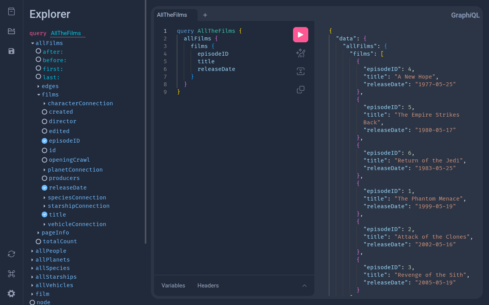
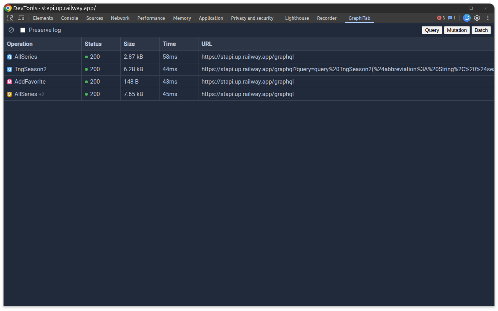
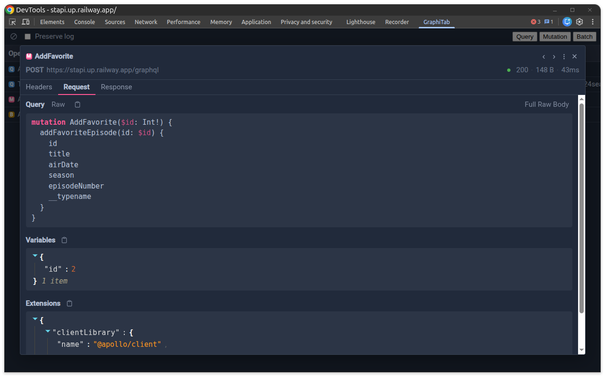
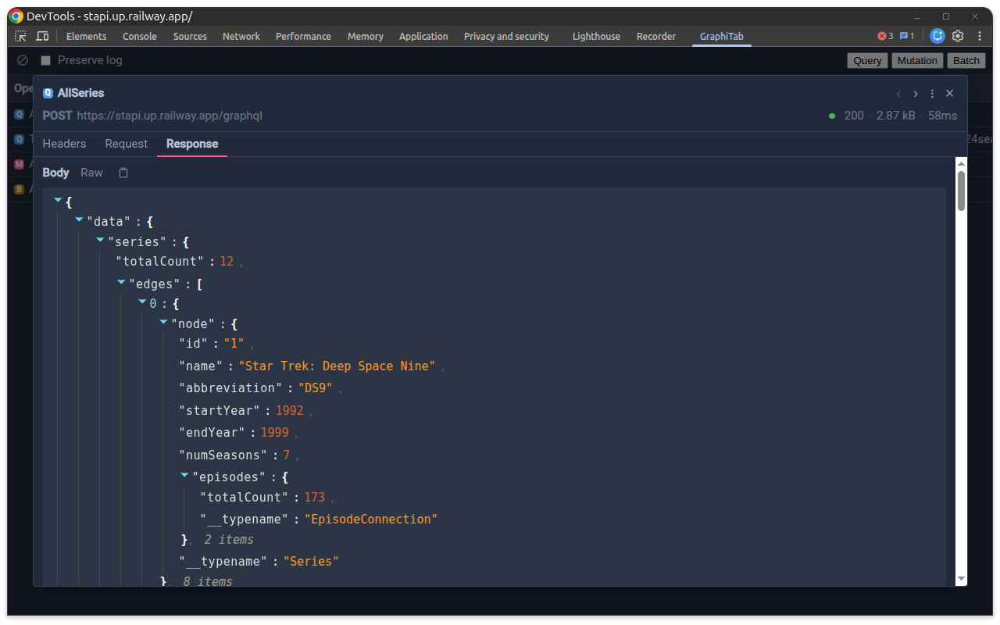

# GraphiTab

A browser extension for [Chrome](https://chromewebstore.google.com/detail/graphitab/cdnbebabankmpeacfgnobmgogoedpmgo) and [Firefox](https://addons.mozilla.org/en-US/firefox/addon/graphitab/) that puts a full [GraphiQL](https://github.com/graphql/graphiql) IDE at your fingertips — no server setup, no hosted playground, just open a new tab and start querying.

**GraphiQL IDE**: Create endpoint profiles with custom headers, then launch any profile into an interactive GraphiQL session powered by the Monaco editor. Browse the schema with the built-in Explorer plugin to discover types and fields, compose queries visually, and save the ones you want to keep with the Saved Queries plugin so you're not rewriting the same request next sprint.



**DevTools Network Inspector**: A dedicated Developer Tools panel captures GraphQL traffic in real time. Inspect operation names, headers, request bodies, and responses at a glance in a resizable grid. Supports POST, GET, and batched requests, with operation-type filtering and one-click copy-as-cURL for quick reproduction outside the browser.







**No ads. No telemetry. No catch.**: GraphiTab collects zero data about you or your usage, contains no advertisements or donation prompts, and is completely open source under the MIT license.

## Prerequisites

- [Node.js](https://nodejs.org/) v24.13.0
- [pnpm](https://pnpm.io/) v10.32.1 — after installing Node.js, enable pnpm via [Corepack](https://nodejs.org/api/corepack.html): `corepack enable`

If you use `asdf` or `mise`, you can use them to activate the necessary tools.

## Setup

```bash
pnpm install
```

## Development

```bash
pnpm dev              # Start dev server (Chrome)
pnpm dev:firefox      # Start dev server (Firefox)
```

## Building

```bash
pnpm build            # Production build (Chrome)
pnpm build:firefox    # Production build (Firefox)
pnpm zip              # Package for Chrome
pnpm zip:firefox      # Package for Firefox
```

## Testing

```bash
pnpm test             # Type-check and run unit tests
pnpm test:coverage    # Run unit tests with coverage
pnpm test:e2e         # Build extension and run Playwright e2e tests
```

## Tech Stack

- [React 19](https://react.dev/)
- [WXT](https://wxt.dev/)
- [GraphiQL 5](https://github.com/graphql/graphiql)
- [Vitest](https://vitest.dev/) + [Playwright](https://playwright.dev/)

## License

MIT
